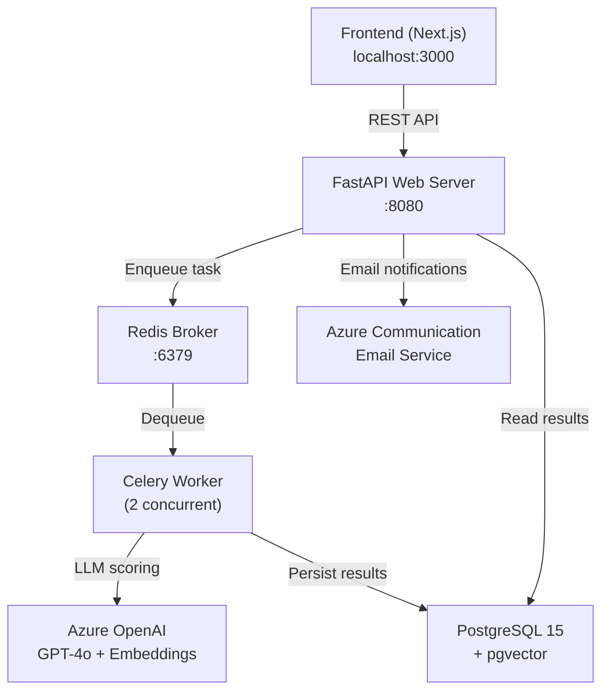
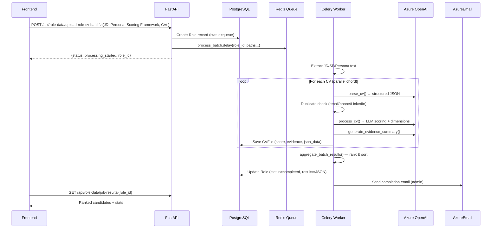
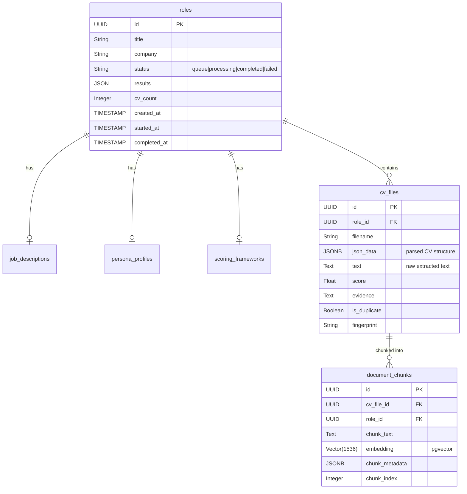
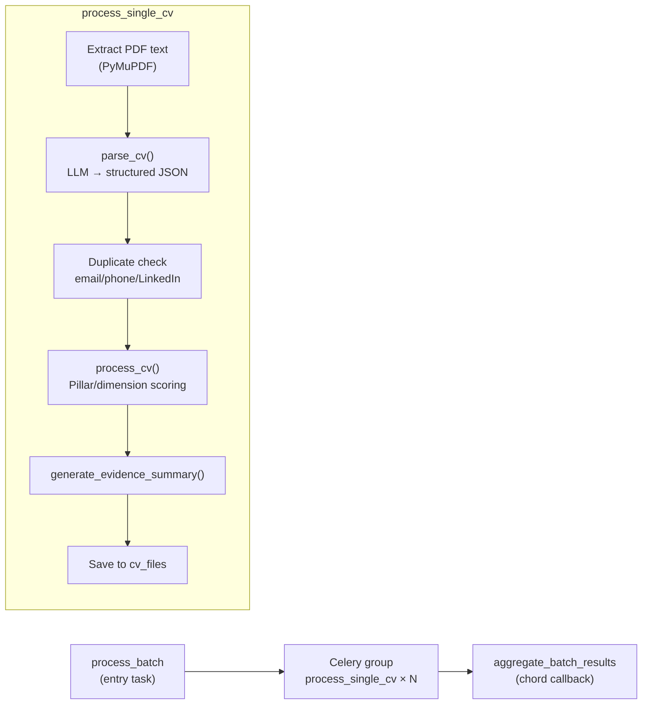
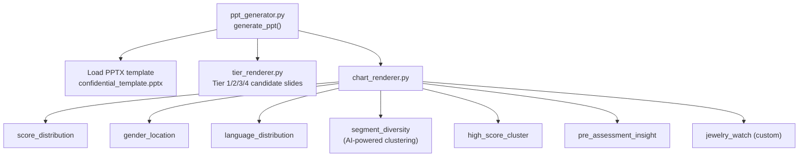
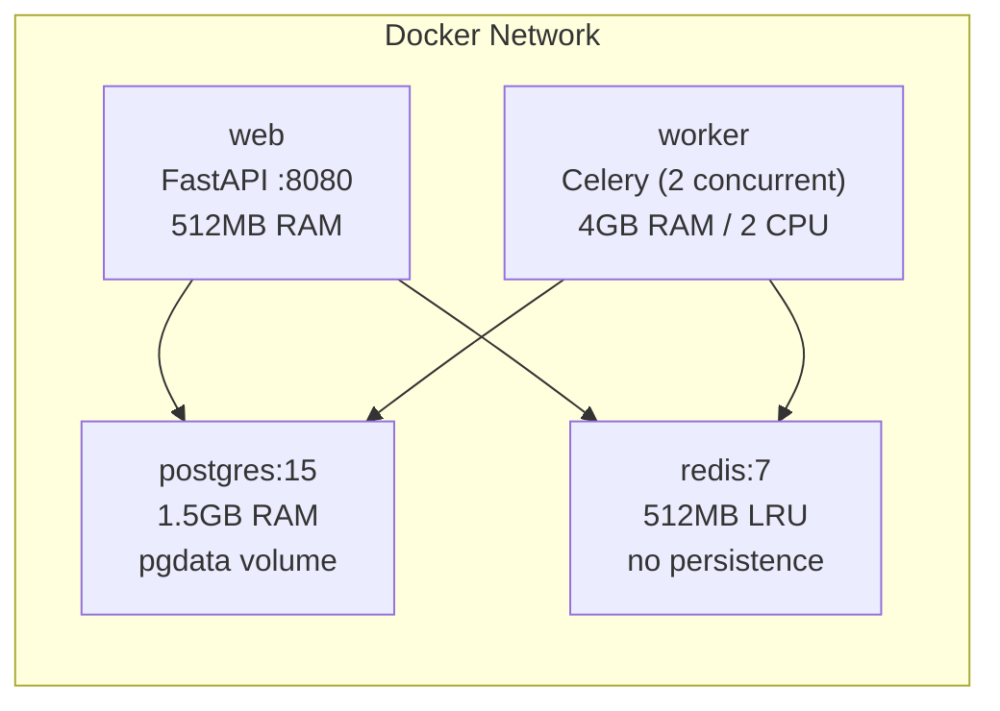

---

# HR Venture — AI-Powered CV Analysis & Ranking Engine

## Project Overview

This is a **backend-only FastAPI application** that automates the end-to-end recruitment pipeline. It accepts bulk CV uploads alongside a Job Description (JD), a Scoring Framework, and an optional Evaluator Persona, then uses **Azure OpenAI (GPT-4o)** to score and rank every candidate. Results can be exported as CSV, DOCX reports, or polished PowerPoint presentations.

---

## High-Level Design (HLD)

### System Context Diagram



### Request Flow — Batch CV Processing



### Key Architectural Decisions

| Decision | Choice | Reason |
|---|---|---|
| API Framework | FastAPI | Async, auto-docs, Pydantic validation |
| Task Queue | Celery + Redis | Async batch processing, parallel chord |
| LLM Provider | Azure OpenAI GPT-4o | Structured JSON output, enterprise compliance |
| DB | PostgreSQL + pgvector | Relational + vector similarity for RAG (future) |
| Migrations | Alembic | Versioned schema migrations |
| Containerization | Docker Compose | 4-service stack tuned for 2-CPU/8GB server |

---

## Low-Level Design (LLD)

### Database Schema



### Module Breakdown

#### role_data.py — REST Endpoints

| Endpoint | Method | Purpose |
|---|---|---|
| `/role-data/roles` | GET | List all roles with CV counts |
| `/role-data/role-status/{role_id}` | GET | Poll job processing status |
| `/role-data/job-results/{role_id}` | GET | Fetch ranked results |
| `/role-data/upload-role-cv-batch` | POST | Upload JD + CVs → triggers Celery |
| `/role-data/roles/{role_id}/export/candidate/{filename}` | GET | Single candidate CSV export |
| `/role-data/roles/{role_id}/export/all` | GET | All candidates CSV export |
| `/role-data/roles/{role_id}/export/report/{filename}` | GET | Candidate DOCX report |
| `/role-data/roles/{role_id}/generate-ppt` | POST | PowerPoint deck generation |

#### celery_app.py — Async Processing Pipeline



Three Celery tasks:
- **`process_batch`** — orchestrator: extracts JD/SF/Persona text, fans out using a `chord(group(...), aggregate_batch_results)`
- **`process_single_cv`** — worker: processes one CV end-to-end, returns a result dict
- **`aggregate_batch_results`** — chord callback: sorts by score, assigns ranks, saves final ranked JSON to `roles.results`, sends email

#### utils — Core Utility Modules

| Module | Responsibility |
|---|---|
| azure_ai.py | Two `AzureOpenAI` clients — `chat_client` (GPT-4o) and `embedding_client` |
| file_extractors.py | PDF → raw text via `PyMuPDFLoader` |
| structured_parser.py | Pydantic models for JD, Persona, Scoring Framework, CV; LLM JSON parsing via `parse_cv()` |
| pillar_dimensions.py | Core LLM scoring prompt + `process_cv()` → returns pillar/dimension scores, `get_relevant_cv_snippets()` using embeddings |
| evidence.py | `generate_evidence_summary()` — bullet-point fit summary via GPT-4o |
| duplicate_checker.py | In-memory `DuplicateChecker` (email/phone/LinkedIn/filename deduplication) |
| export_files.py | CSV and DOCX export builders |
| `file_util.py` | `save_temp()` — saves uploaded files to `/tmp/hr_uploads/{role_id}/` |
| azure_email.py | Azure Communication Services email sender |
| `email_templates.py` | Jinja2 template rendering for email subject/body |

#### ppt — PowerPoint Report Generator



Candidates are split into **Tier 1** (top-X), **Tier 2** (score ≥ 65, up to 50), **Tier 3/4** (rest). Each tier has its own slide template and layout rules defined in template_config.py.

#### LLM Scoring Model — Pillar/Dimension Framework

The scoring prompt in pillar_dimensions.py implements a rigorous evaluation:

- Evidence MUST come verbatim from the CV
- Each dimension in the Scoring Framework is evaluated independently
- Scores follow a 1–5 behavioral anchor scale, mapped to 1–10 and then weighted
- Pillar weights from the Scoring Framework determine the `final_score` (out of 100)
- Persona file acts as an interpretive lens but cannot inflate scores without evidence

---

## Infrastructure (Docker Compose)



Memory is carefully budgeted for a **2-core / 8GB RAM** server. The worker is given 4GB to handle large LLM context windows. Celery is configured with `max-tasks-per-child=30` to prevent memory leaks from repeated LLM calls.

---

## Data Flow Summary

```
[Upload API] → save files to disk
     ↓
[Celery: process_batch]
     ↓ extract JD/SF/Persona text
     ↓
[Celery chord: N × process_single_cv] (parallel)
     ↓ PDF → text → LLM parse → duplicate check → LLM score → evidence
     ↓
[Celery: aggregate_batch_results]
     ↓ sort by score → assign ranks → save to roles.results
     ↓ send admin email
     ↓
[GET job-results] → ranked candidates with scores, dimensions, evidence
     ↓
[Export] → CSV / DOCX / PowerPoint presentation
```
