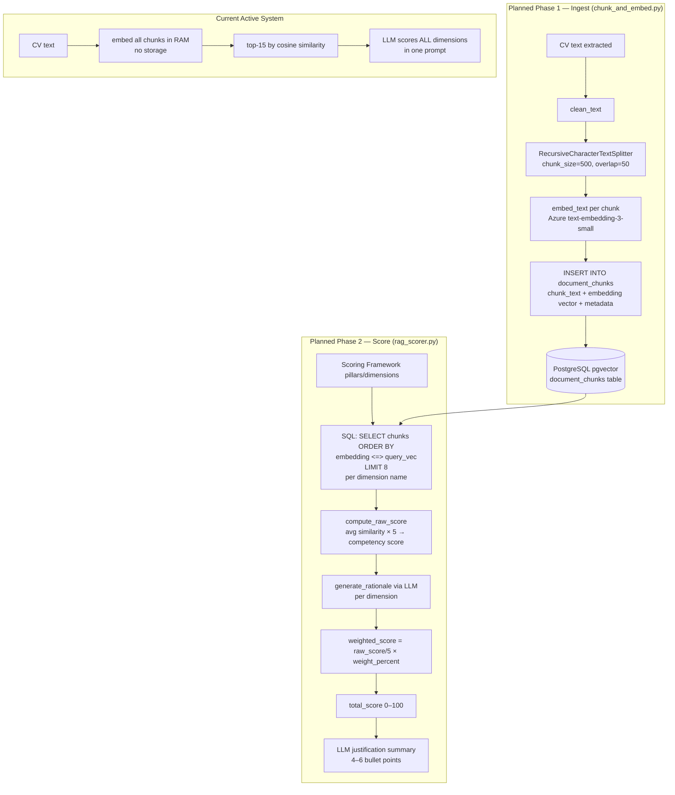

---

## What the Full RAG System Was Designed to Be

### The Architectural Gap: Two-Phase vs One-Phase

The commented code reveals a **fundamentally different** pipeline architecture, not just an upgrade. The current system does everything in one hot pass per CV. The planned system split it into two distinct phases:



---

### chunk_and_embed.py — What It Would Have Done

Its single job was **ingestion**: take a CV file, clean and split it, embed every chunk, and write them all to the `document_chunks` table with the pgvector `Vector(1536)` column. From the code:

```python
# What would have run after extract_text_from_path():
raw_text = extract_text_from_path(cv_path)
clean = clean_text(raw_text)          # strips page numbers, blank lines
chunks = split_into_chunks(clean)     # identical splitter to current system
embeddings = [embed_text(c["text"]) for c in chunks]

# Then persisted to DB, not discarded:
db_chunk = DocumentChunk(
    cv_file_id=cv_file_id,
    role_id=role_id,
    chunk_text=chunk["text"],
    embedding=embedding,              # stored in Vector(1536) column
    chunk_metadata={"chunk_index": i, "char_start": chunk["start_char"], "source": "cv"},
    chunk_index=i
)
db.add(db_chunk)
db.commit()
```

**Key difference from today**: embeddings would have been computed **once and stored**. The current system computes them on every run, throws them away, and recomputes them if you ever reprocess the same CV.

---

### rag_scorer.py — What It Would Have Done

This is where the architecture diverges most sharply. There were **two distinct versions** in the file:

#### Version 1 (the earlier attempt, second commented block):
Used JD requirements and must-haves as queries, ran `search_chunks()` for each, deduplicated results, and computed a single flat `relevance_score` from average chunk similarity. Output: a relevance score + text evidence bullets. This was essentially a **similarity-only score** with no per-dimension breakdown.

#### Version 2 (the "FINAL VERSION", first and larger block):
Fundamentally more sophisticated. It looped **per dimension** in the scoring framework:

```python
for pillar in pillars:
    for dim in pillar["dimensions"]:
        # Use the DIMENSION NAME as the search query
        dim_chunks = search_chunks(db, query=dim_name, role_id=..., top_k=8)
        # SQL: SELECT chunks ORDER BY embedding <=> embed(dim_name) LIMIT 8

        raw_score = compute_raw_score([c["score"] for c in dim_chunks])
        # avg_similarity × 5 → competency score (0–5)

        score_10 = raw_score × 2.0
        weighted = (raw_score / 5) × weight_percent

        rationale = generate_rationale(dim_name, best_chunk_text)
        # LLM call: "explain how this evidence supports {dim_name}"
```

Then it generated a final justification summary from the aggregated dimension scores.

**This is a profoundly different scoring model**:

| | Current System | Planned RAG System |
|---|---|---|
| What LLM sees | 15 chunks + full JD + full scoring framework in one prompt | Only the top-8 chunks per individual dimension |
| Who does the scoring | LLM assigns all dimension scores in one response | Cosine similarity math assigns the score; LLM only explains it |
| Evidence grounding | LLM picks its own evidence from context window | Evidence is the literal chunk that SQL retrieved |
| Cost per CV | 3 LLM calls + N×embed (ephemeral) | 1×embed per chunk (once, stored) + D×SQL queries + D×small LLM calls |
| Reproducibility | LLM scoring can vary run-to-run | SQL retrieval is deterministic; LLM only writes rationale |
| Evidence with page numbers | No | Yes — `page_start`, `page_end` stored in `chunk_metadata` |

The `search_chunks()` function used pgvector's native `<=>` (cosine distance) operator directly in SQL:

```sql
SELECT chunk_text, chunk_metadata, (embedding <=> :query_vec) AS distance
FROM document_chunks
WHERE role_id = :role_id AND cv_file_id = :cv_file_id
ORDER BY distance
LIMIT 8
```

This is what pgvector is actually built for — indexed ANN (approximate nearest neighbor) queries — vs the current approach which does raw numpy dot products in Python against unindexed in-memory arrays.

---

### `DuplicateChecker` — What It Was Supposed to Replace

The class in duplicate_checker.py is fully implemented and never used. It was designed as an **in-memory set** to be instantiated once per batch and passed to each CV task:

```python
checker = DuplicateChecker()
# Per CV:
if checker.is_duplicate(filename, email, phone, linkedin):
    mark as duplicate
else:
    checker.mark_unique(filename, email, phone, linkedin)
```

The problem: Celery tasks run in **separate processes**. An in-memory object cannot be shared across workers. That's exactly why the DB-based scan was used instead — it's the only cross-process state. But the DB scan is O(N²) and has the race condition described in the architecture doc.

The correct way to activate `DuplicateChecker` properly would be to back it with Redis (using sets per `role_id`), not Python memory.

---

## How It Would Fit Into the Whole Pipeline

Here is where each piece would have plugged in, referencing the actual call site in celery_app.py:

```python
# celery_app.py — process_single_cv (currently active line ~155)
# chunk_cv_and_store(db, cv_path, cv_file.id, role_id)   ← THIS IS COMMENTED OUT

# If it were active:
# 1. chunk_and_embed.py runs FIRST — chunks persisted to document_chunks
# 2. Then instead of get_relevant_cv_snippets() (in-memory):
#    rag_result = score_candidate_with_rag(db, cv_file.id, role_id, jd_json, sf_json)
# 3. That returns: overall_match_score_100, job_fit_category, evidence_summary, per-dimension details
# 4. No second LLM call (call_llm_structured) needed — scores come from vector similarity math
# 5. evidence.py (generate_evidence_summary) might still run, or be replaced by per-dimension rationale
```

The planned flow per CV would have been:

```
extract_text → chunk_and_embed (store to DB) → parse_cv (LLM call 1, unchanged)
→ score_candidate_with_rag (SQL per dimension, cosine math, small LLM rationale per dim)
→ no call_llm_structured (eliminated)
→ aggregate results
```

vs current:

```
extract_text → parse_cv (LLM 1) → get_relevant_cv_snippets (RAM embed) → call_llm_structured (LLM 2) → generate_evidence_summary (LLM 3)
```

---

## Net Impact of Enabling the Full RAG System

**Positive impacts:**

| Area | Current Problem | RAG System Solution |
|---|---|---|
| **Cost** | N embedding calls per CV per run, all discarded | Embed once per chunk, stored; re-queries are pure SQL |
| **Scoring reliability** | LLM hallucinates scores, needs `check_hallucinations()` to fix | Scores come from deterministic cosine math; LLM only narrates |
| **Evidence grounding** | LLM picks its own evidence from a 15-chunk window | Evidence is the exact retrieved chunk, with page number metadata |
| **Reprocessing** | Reprocessing = re-embed everything | Reprocessing = just re-query stored embeddings |
| **Auditability** | "Why did this candidate score X?" requires re-running the LLM | `document_chunks` rows are the audit trail — queryable, persistent |
| **Scale** | 100 CVs × 500 chunks = 50,000 embedding API calls per batch | 100 CVs × 500 chunks = 50,000 calls once; subsequent queries are SQL |

**What would still be needed before enabling it:**

1. `document_chunks` table would need to be created (`create_all` will do it since the ORM model is already in role.py)
2. A pgvector HNSW or IVFFlat index on `embedding` column for query performance at scale
3. `DuplicateChecker` would need Redis backing to actually be race-condition-safe
4. The `process_single_cv` call site would need to swap `get_relevant_cv_snippets` + `call_llm_structured` for `score_candidate_with_rag` — the function signatures are already compatible (both take `db`, `role_id`, `jd_json`, `sf_json`)
5. `OPENAI_BASE_URL` is still needed because `generate_rationale()` in rag_scorer.py uses `chat_client` (the `AzureOpenAI` client), but the rationale LLM calls would be smaller and per-dimension instead of one massive scoring prompt
