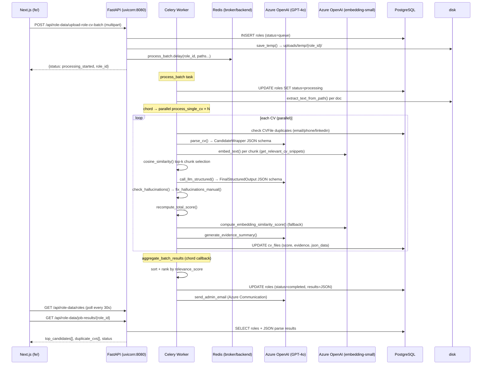

---

# HR-Venture Codebase: Architecture Analysis

---

## 1. End-to-End Architecture (Runtime Flow)



**Key architectural fact**: There is no ChromaDB. The pgvector integration and rag_scorer.py / chunk_and_embed.py are 100% commented out. The only vector operation in production is embedding-based **chunk selection** inside `pillar_dimensions.py:get_relevant_cv_snippets()` — purely to pick which CV text snippets go into the prompt.

---

## 2. Critical File Map (Execution Order)

| Order | File | Owns | Called By | Calls | Key Lines |
|---|---|---|---|---|---|
| 1 | main.py | App init, CORS, router mount | uvicorn entry | `init_db()`, `role_router` | `origins` list (hardcoded IPs — security risk), `expose_headers: Content-Disposition` |
| 2 | database.py | SQLAlchemy engine + session factory | main.py, all Celery tasks | PostgreSQL via psycopg2 | `pool_pre_ping=True, pool_recycle=1800` — keeps connections alive |
| 3 | role_data.py | All HTTP routes | FastAPI router | crud, celery, file_util | `process_batch.delay()` at line ~90 — the only async dispatch point |
| 4 | file_util.py | File persistence | role_data.py API | disk | `save_temp()` — strips unsafe chars, 1MB chunked write |
| 5 | celery_app.py | All async processing orchestration | Redis/Celery | every util | `chord(cv_tasks)(callback)` — the parallel fan-out; `aggregate_batch_results` — the fan-in |
| 6 | file_extractors.py | PDF → raw text | celery_app.py | PyMuPDFLoader | Only PDFs supported; no DOCX path despite form accepting `.docx` |
| 7 | structured_parser.py | CV parsing Pydantic schemas + `parse_cv()` | celery_app.py | Azure OpenAI | `parse_cv()` — first LLM call; uses `response_format: json_schema` |
| 8 | pillar_dimensions.py | Chunk selection, LLM scoring, hallucination control | celery_app.py | Azure OpenAI, embed_text | `get_relevant_cv_snippets`, `call_llm_structured`, `check_hallucinations`, `process_cv` |
| 9 | azure_ai.py | Azure OpenAI client singletons | All utils | Azure OpenAI API | Two clients created at module load — both share same endpoint/key |
| 10 | evidence.py | LLM-generated evidence bullet text | celery_app.py | Azure OpenAI | Third LLM call per CV |
| 11 | role.py | All SQLAlchemy ORM models | All DB layers | PostgreSQL | `Role.results = Column(JSON)` — entire ranked list serialized as JSON blob |
| 12 | role_data.py | All DB read/write operations | API + Celery | models, SQLAlchemy | `get_roles_with_cv_count` — complex join query; `update_cv_file` — upsert pattern |

---

## 3. RAG Pipeline Deep Dive

### What Is and Is Not Active

**CONFIRMED DEAD CODE** (fully commented out):
- chunk_and_embed.py — entire file
- rag_scorer.py — entire file
- pgvector `document_chunks` table (referenced but never created via ORM's `create_all`)
- `chunk_cv_and_store()` call in celery_app.py line ~155

**ACTIVE "RAG-lite" path** — `pillar_dimensions.py:get_relevant_cv_snippets()`:

```
CV text → RecursiveCharacterTextSplitter
  chunk_size=500, chunk_overlap=50
  separators=["\n\n", "\n", ".", "!", "?", ",", " ", ""]
  → N chunks

JD text (full) → embed_text() → vector

For each chunk → embed_text() → vector
  cosine_similarity(jd_embedding, chunk_embedding)

Top K=15 chunks by similarity selected → joined as string
  + "\n\n--- FULL CV CONTEXT ---\n\n" + cv_text[:3000]
→ candidate_cv_context fed into prompt
```

**Important**: Every chunk gets its own `embed_text()` call. For a 500-chunk CV that is 500 Azure embedding API calls. With `top_k=15` (`TOP_K_CV_CHUNKS=50` in module but called with `top_k=15` from celery_app.py), this is the most expensive non-LLM step.

### Embedding Model
- Deployment: `EMBEDDING_DEPLOYMENT` env var, default `"embedding-small"` (Azure's `text-embedding-3-small`)
- Fallback: `text-embedding-ada-002` on error
- Client: `AzureOpenAI` at `api_version="2024-07-01-preview"`
- **Both `chat_client` and `embedding_client` are the same class/endpoint** — there is no functional difference between them (confirmed by inspecting azure_ai.py)

### Vector Retrieval Details
```python
# pillar_dimensions.py
SEMANTIC_THRESHOLD = 0.70
FUZZY_THRESHOLD = 75
TOP_K_CV_CHUNKS = 50  # module constant, overridden to 15 at call site

def cosine_similarity(text1, text2):
    emb1 = embed_text(text1)  # full Azure call each time
    emb2 = embed_text(text2)  # full Azure call each time
    return dot(emb1, emb2) / (norm(emb1) * norm(emb2))
```

No indexing, no caching, no batching — pure O(N) per-chunk similarity.

### 3-Tier Evidence Verification
`verify_evidence(claim, source_text, source_chunks)` — runs on every `skill_match.evidence_from_cv`:
1. Exact substring match
2. rapidfuzz `token_set_ratio >= 75`
3. `cosine_similarity >= 0.70` (triggers more embedding calls)

If `hallucination_rate > 5%`: runs `fix_hallucinations_manual()` — penalizes unverifiable dimensions by `max(2.90, old_score - 1.0)`.

---

## 4. OpenAI Integration

**Critical distinction**: azure_ai.py defines `chat_client` which uses `response_format={"type":"json_object"}` via `chat_complete()`. But pillar_dimensions.py and structured_parser.py use a **separate** `OpenAI` client (not `AzureOpenAI`), initialized inline:

```python
# pillar_dimensions.py and structured_parser.py
openai_client = OpenAI(
    api_key=os.getenv("AZURE_OPENAI_KEY"),
    base_url=os.getenv("OPENAI_BASE_URL")   # ← pointed at Azure via OPENAI_BASE_URL
)
```

This is an `openai.OpenAI` (not `AzureOpenAI`) client pointed at an Azure endpoint via `base_url`. It enables `response_format: json_schema` (structured outputs) which `AzureOpenAI` at the older api-version may not support.

**Three LLM calls per CV**:

| Call | File | Function | Model | Format | Purpose |
|---|---|---|---|---|---|
| 1 | structured_parser.py | `parse_cv()` | `CHAT_DEPLOYMENT` (gpt-4o) | `json_schema: CandidateWrapper` | Extract structured candidate data |
| 2 | pillar_dimensions.py | `call_llm_structured()` | `LLM_MODEL = "gpt-4o"` (hardcoded) | `json_schema: FinalStructuredOutput` | Score across all pillars/dimensions |
| 3 | evidence.py | `generate_evidence_summary()` | `CHAT_DEPLOYMENT` (gpt-4o) | plain text | Generate bullet evidence narrative |

**None are streamed.** All are `response.choices[0].message.content` buffered JSON. No function calling. No tool use. No retry logic (bare try/except, no exponential backoff). No token counting or context limit management.

**Scoring formula** (hardcoded in pillar_dimensions.py):
```
behavioral_anchor_score_1_5 (1–5)
→ score_10_scale = score × 2
→ weighted_score = score_10_scale × (weight_percent / 100) × 10
→ overall_match_score_100 = sum of all weighted_scores
→ adjusted_llm_score = overall × (1 - hallucination_rate/100)
→ similarity_score = embedding cosine, mapped [0.3–0.9] → [0–100]
→ final_score:
    if overall <= 0: use similarity_score
    elif adjusted < 0.5 × similarity: 0.75×adjusted + 0.35×similarity  ← blended
    else: adjusted_llm_score
```

---

## 5. Database and Persistence

### Storage Layers

**PostgreSQL** (only active DB):

| Table | Key Columns | Notes |
|---|---|---|
| `roles` | `id UUID`, `status`, `results JSON`, `cv_count`, `started_at`, `completed_at` | `results` stores the entire ranked candidate list as a JSON blob — no normalization |
| `cv_files` | `id UUID`, `role_id FK`, `filename`, `json_data JSONB`, `text TEXT`, `score FLOAT`, `evidence TEXT`, `is_duplicate BOOL`, `rank INT` | `rank` column referenced in code but NOT in ORM model definition |
| `job_descriptions` | `role_id FK UNIQUE`, `json_data JSONB`, `raw_text TEXT` | Written by `update_job_description()` but this is **never called** from active code paths |
| `persona_profiles` | same pattern | Also never written in active flow |
| `scoring_frameworks` | same pattern | Also never written |

**Schema drift confirmed**: `alembic/versions/0001_initial.py` does not match the current ORM models. Models have added `status`, `results`, `cv_count`, `started_at`, `completed_at`, `rank`, `score`, `evidence`, `is_duplicate`, `fingerprint` columns that are not in the migration. The DB schema is maintained via `Base.metadata.create_all(bind=engine)` on startup — Alembic is effectively unused after the initial migration.

**Redis**: Used only as Celery broker (db=0) and result backend (db=1). `maxmemory-policy allkeys-lru` — results will be evicted after 30 minutes (`result_expires=1800`).

**File storage**: `uploads/temp/{role_id}/` on the FastAPI container's local filesystem. **Celery workers and web container must share this volume** — confirmed by docker-compose.yml mounting `.:/app`. No S3 / blob storage.

**No caching layer** of any kind beyond Redis-as-Celery-backend. No application-level cache, no Redis key-value cache.

### Transaction Boundaries
- `SessionLocal` is created per-request (API) or per-task (Celery). `autocommit=False`, `autoflush=False`.
- DB sessions are **not passed** between tasks — each `process_single_cv` creates its own session.
- `aggregate_batch_results` does a non-atomic multi-row commit (loops `db.add(cv_file)` then one `db.commit()`).
- `Role.results` is written in one `db.commit()` at the end of aggregation — atomic for that field.
- No explicit locking. Concurrent tasks writing different CVs to `cv_files` are safe by `role_id + filename` key. But the duplicate-check loop (scan all existing CVs for email/phone match) is **not atomic** — race condition exists if two tasks for the same email run simultaneously.

---

## 6. Concurrency and Async Behavior

**FastAPI layer**: Single-threaded uvicorn with async routes. `upload-role-cv-batch` is `async def` but does `await save_temp()` for each CV sequentially — not parallelized.

**Celery layer**:
- `process_batch` dispatches a `chord(group([process_single_cv.s(...) for cv in cv_paths]))(aggregate_batch_results.s(role_id))`
- CVs process **in parallel** across available Celery workers. Config: `worker_prefetch_multiplier=1`, `worker_max_tasks_per_child=30`
- Worker memory: 4GB limit (docker), 2 concurrent workers (inferred from 2-CPU config)
- Each `process_single_cv` makes ~3 LLM calls + N embedding calls — highly I/O-bound, suited for async but tasks are sync

**Race condition (confirmed)**: The duplicate-by-email check in `process_single_cv` reads all non-duplicate CVFile rows and scans them in Python. If two tasks run simultaneously for the same role and both read before either writes, both could pass the duplicate check and both get persisted. The in-memory `DuplicateChecker` class in duplicate_checker.py is **never instantiated** in celery_app.py — the DB-based check is used instead, which has this race.

**Polling**: The frontend polls `/api/role-data/roles` every 30 seconds (`setInterval(30000)`) when any role has `status=processing`. No WebSocket, no SSE, no push.

---

## 7. Security Analysis

**Confirmed issues**:

| Issue | Location | Severity |
|---|---|---|
| CORS `allow_origins` hardcodes prod IPs | main.py lines 24-25 | Medium — deploy mistake breaks dev, but at least not `*` |
| No auth on any backend route | `api/role_data.py` | **Critical** — any anonymous caller can upload CVs, read all results, export data |
| `AZURE_OPENAI_KEY` stored in `.env`, passed via env vars — acceptable | azure_ai.py | Low |
| File upload has no MIME type check | `file_util.py:save_temp()` | Medium — accepts any bytes, relies on frontend `accept=` attribute only |
| File upload has no size limit | file_util.py | Medium — no max file size enforcement |
| `role.results` deserialized via `json.loads()` without validation | `api/role_data.py` lines 50, 131, 170 | Low (internal data) |
| `LLM_MODEL = "gpt-4o"` hardcoded | pillar_dimensions.py | Low — ignores `CHAT_DEPLOYMENT` env var for the main scoring call |
| Global exception handler is commented out | main.py lines 16-18 | Medium — unhandled exceptions leak stack traces |
| Frontend auth middleware only protects `/aisuite`, `/files`, `/admin` paths | middleware.ts | **Critical** — `/roles`, `/results`, `/upload-role-file` require NO auth |
| Static demo credentials in source code | auth.ts lines 8-10: `test@test.com / Mod123456!` | **Critical** — hardcoded creds committed to repo |
| No prompt injection protection | all LLM call sites | Medium — CV text is injected verbatim into prompts |
| No rate limiting | entire API | Medium |

---

## 8. Frontend Integration

**Pages**:
- `/` → page.tsx — landing, links to roles/upload/ppts. No auth required.
- `/upload-role-file` → page.tsx — form, `multipart/form-data` POST, redirects to `/roles` on success.
- `/roles` → page.tsx — polls `/api/role-data/roles` every 30s if any job is `processing`.
- `/results/[role_id]` → [fe/app/results/[role_id]/page.tsx](fe/app/results/%5Brole_id%5D/page.tsx) — single GET on mount, all display logic client-side.

**State management**: Pure `useState` + `useEffect`. No Redux, no Zustand, no React Query. No global state.

**Auth**: Microsoft Entra ID via NextAuth.js (`lib/auth.ts`). JWT strategy. Access token attached to session. **The axios interceptor in axios.ts does NOT attach the token to requests** — `Authorization` header injection is commented out ("set via client-side session bridge"). So backend receives no auth token and cannot validate it regardless.

**Loading/error**: Inline `loading` state per page. No skeleton loaders for results (shows spinner). No error boundaries.

**No streaming**: Results page does a single GET after upload completes. No partial render of results as CVs finish.

---

## 9. Watch List — Critical Code Blocks

| File | Function/Line | Why Critical | What Breaks If Changed |
|---|---|---|---|
| celery_app.py | `chord(cv_tasks)(callback)` ~line 370 | Entire parallel pipeline depends on this. If Redis goes down or chord fails, `aggregate_batch_results` never runs, role stays `processing` forever. | Batch never completes; no recovery path. |
| pillar_dimensions.py | `call_llm_structured()` — `response_format: json_schema` | Uses `openai.OpenAI` not `AzureOpenAI`; `OPENAI_BASE_URL` must be set. Any schema change to `FinalStructuredOutput` breaks this silently if model returns non-conforming JSON. | Scoring returns empty/error; CV skipped. |
| pillar_dimensions.py | `recompute_total_score()` | Overrides LLM-computed scores. Formula: `score × 2 × (weight/100) × 10`. If weights don't sum to 100, overall score will be wrong. | Total score silently incorrect. |
| pillar_dimensions.py | `process_cv()` → score blending logic | `final_score` can be `0.75 * adjusted + 0.35 * similarity` — weights sum to 1.10, not 1.0. This is a confirmed bug. | Scores can exceed theoretical max. |
| celery_app.py | `process_single_cv` — duplicate check loop | O(N²) across all CVs for a role. For 100 CVs processed in parallel, each task queries all existing CVFiles. Not atomic → race condition. | Duplicates slip through under load. |
| role.py | `Role.results = Column(JSON)` | Entire ranked list stored as a single JSON column. For 200 CVs with full structured_output, this blob can be several MB. `json.loads()` called on every results request. | Memory spike on large batches; slow reads. |
| pillar_dimensions.py | `get_relevant_cv_snippets()` | Makes one embedding call per chunk. 500-chunk CV = 500 API calls before LLM scoring even starts. | Cost explosion; rate limit hits on large batches. |
| main.py | `init_db()` on startup | Uses `create_all` not Alembic — adds missing columns silently. If Postgres doesn't have `rank` column in `cv_files` it will fail at write time (model has it, migration doesn't). | `cv_file.rank = i` throws at runtime. |

---

## 10. Recommended Reading Path

1. main.py — 35 lines, shows app structure and what's wired
2. celery_app.py — read `process_batch` → `process_single_cv` → `aggregate_batch_results` in that order; this is the entire pipeline
3. azure_ai.py — understand both clients and the fallback
4. structured_parser.py — `parse_cv()`, then `FinalStructuredOutput` Pydantic model, then `recompute_total_score()`
5. pillar_dimensions.py — read top-to-bottom: prompts → `get_relevant_cv_snippets` → `call_llm_structured` → `check_hallucinations` → `fix_hallucinations_manual` → `process_cv`
6. evidence.py — trivial, one function
7. role.py — understand what's actually persisted
8. role_data.py — `update_cv_file` (upsert), `get_roles_with_cv_count` (complex query)
9. page.tsx — UI trigger point
10. [fe/app/results/[role_id]/page.tsx](fe/app/results/%5Brole_id%5D/page.tsx) — result rendering, understand the data shape

---

## Confirmed vs Likely vs Unknown

**Confirmed from code:**
- No ChromaDB anywhere — requirements.txt has no `chromadb`
- pgvector is installed but the `document_chunks` table is never created by active ORM; all vector-DB-related code is commented out
- Three LLM calls per CV (parse → score → evidence)
- No auth on backend routes
- Score blending formula has a weight bug (sums to 1.10)
- `worker_max_tasks_per_child=30` causes worker restart every 30 CVs

**Likely based on code:**
- `OPENAI_BASE_URL` must point to Azure's OpenAI-compatible endpoint for `openai.OpenAI(base_url=...)` to work — not documented anywhere in README
- The `rank` column in `CVFile` is referenced but not in the ORM model definition visible in the file — likely added manually to the DB or causes silent failures

**Unknown/ambiguous:**
- Whether `job_descriptions`, `persona_profiles`, `scoring_frameworks` tables actually receive data (their write calls are commented out — these tables exist but may always be empty)
- Whether `XLSX` scoring framework files are handled — file_extractors.py only implements `PyMuPDFLoader` (PDF only); XLSX accepted in the form but will throw at extraction
- Whether the admin email actually sends — `send_admin_email` is called but Azure Communication Services config is not visible


+++++++++++++++++++++++++++++++++++++++++++++++++++++++++++++++++++++++++++++++++++++++++++++++++++++++++++++++++++++++++++++++++++++++++++++++++++++++++++++++++
+++++++++++++++++++++++++++++++++++++++++++++++++++++++++++++++++++++++++++++++++++++++++++++++++++++++++++++++++++++++++++++++++++++++++++++++++++++++++++++++++


Read [](file:///c%3A/Temporary_Stuff/Personal/HR-venture/be/app/utils/pillar_dimensions.py#1-1), lines 1 to 30

Searched for regex `def get_relevant_cv_snippets|def cosine_similarity|def split_into_chunks|def call_llm_structured|def process_cv|def check_hallucinations|def fix_hallucinations|def compute_embedding_similarity|def verify_evidence|def exact_match|def fuzzy_match|def semantic_match` (`**/be/app/utils/pillar_dimensions.py`), 12 results

Read [](file:///c%3A/Temporary_Stuff/Personal/HR-venture/be/app/utils/pillar_dimensions.py#460-460), lines 460 to 740

Searched for text `recompute_total_score` (`**/be/app/utils/structured_parser.py`), 1 result

Read [](file:///c%3A/Temporary_Stuff/Personal/HR-venture/be/app/utils/pillar_dimensions.py#772-772), lines 772 to 882

Read [](file:///c%3A/Temporary_Stuff/Personal/HR-venture/be/app/utils/structured_parser.py#195-195), lines 195 to 265

Here is the zoomed-in analysis. Everything below is confirmed from exact file reads with line numbers.

---

## RAG Pipeline: Exact File/Function/Line Reference

### First: ChromaDB Status

**ChromaDB does not exist in this codebase.** requirements.txt has no `chromadb`. The word does not appear anywhere. The pgvector-based retrieval (rag_scorer.py, chunk_and_embed.py) is entirely commented out. What follows is the complete picture of what is actually active.

---

## Stage 1 — Chunking

**File**: pillar_dimensions.py, lines 471–483

```python
def split_into_chunks(text: str):
    splitter = RecursiveCharacterTextSplitter(
        separators=["\n\n", "\n", ".", "!", "?", ",", " ", ""],
        chunk_size=500,       # ← chars, not tokens
        chunk_overlap=50,
        length_function=len,
    )
    chunks = splitter.split_text(text)
    if not chunks:
        chunks = [text.strip() if text.strip() else ""]
    return chunks
```

Called in three separate contexts:
- Inside `get_relevant_cv_snippets()` — on the CV before retrieval (line 507)
- Inside `check_hallucinations()` — on the full CV to build `cv_chunks` (line 777)
- Inside `fix_hallucinations_manual()` — on both CV and JD (lines 615, 616)

`chunk_size=500` chars is small. A typical CV page is ~3000 chars, so a 3-page CV produces ~18–30 chunks. The `print()` statement at line 482 logs chunk count to stdout, not to the logger — it will appear raw in docker logs.

---

## Stage 2 — Embedding

**File**: azure_ai.py, lines 27–40

```python
def embed_text(text: str) -> list:
    if not text.strip():
        text = "unknown"
    try:
        resp = embedding_client.embeddings.create(
            input=text,
            model=embedding_deployment   # env: EMBEDDING_DEPLOYMENT, default "embedding-small"
        )
        return resp.data[0].embedding
    except Exception as e:
        print(f"Embedding failed, using ada-002: {e}")
        resp = embedding_client.embeddings.create(
            input=text,
            model="text-embedding-ada-002"
        )
        return resp.data[0].embedding
```

`embed_text` takes **one string at a time**. No batching. Called once per CV chunk in `get_relevant_cv_snippets`, and once more for the entire JD. The fallback `ada-002` on error can silently produce a vector from a different embedding space — mixed-space cosine comparisons will return garbage similarity values without any warning.

---

## Stage 3 — Retrieval (the only active "RAG" step)

**File**: pillar_dimensions.py, lines 504–532

```python
def get_relevant_cv_snippets(job_description: str, cv_text: str, top_k: int = TOP_K_CV_CHUNKS) -> str:
    cv_chunks = split_into_chunks(cv_text)         # L507
    if not cv_chunks:
        return cv_text

    similarities = []
    for chunk in cv_chunks:                        # L512 — O(N) embedding calls
        sim = cosine_similarity(job_description, chunk)
        similarities.append(sim)

    sims = np.array(similarities)
    top_k = min(top_k, len(cv_chunks))
    top_indices = sims.argsort()[-top_k:][::-1].tolist()   # L519 — descending sort, top-k indices

    selected_chunks = [cv_chunks[i] for i in top_indices]
    return "\n\n".join(selected_chunks)            # L523 — no score attached to output
```

**Important**: `cosine_similarity(job_description, chunk)` at line 513 embeds the **full JD text** fresh on every loop iteration — it is called once per chunk, not once per CV. For a 20-chunk CV that is 20 JD embeddings + 20 chunk embeddings = 40 API calls just for retrieval.

The module-level constant is `TOP_K_CV_CHUNKS = 50` (line 465), but the call site in celery_app.py passes `top_k=15` explicitly. The returned string carries no similarity scores — they are discarded after selection.

**Retrieval output is then augmented** in celery_app.py at lines ~163–166:

```python
candidate_cv_context = (
    get_relevant_cv_snippets(jd_text, cv_text, top_k=15)
    + "\n\n--- FULL CV CONTEXT (FOR BEHAVIORAL DIMENSIONS) ---\n\n"
    + cv_text[:3000]                  # ← first 3000 chars always appended
)
```

So the final context fed into the prompt is: **top-15 semantic chunks + first 3000 characters of raw CV**. The first 3000 chars are hardcoded and always included regardless of relevance.

---

## Stage 4 — Prompt Assembly

**File**: pillar_dimensions.py, function `call_llm_structured`, lines 650–713

Template selection at line 652:

```python
if "prompt_instructions" in input_data and input_data["prompt_instructions"].strip():
    prompt_template = prompt_with_persona     # ~line 300 in the file
else:
    prompt_template = prompt_without_persona  # ~line 16 in the file
```

Both templates are defined as module-level string constants. The prompt is assembled via `.format(**input_data)` — the dict keys `{job_description}`, `{scoring_framework}`, `{candidate_cv}`, and optionally `{prompt_instructions}` are interpolated directly. **No escaping, no sanitization** — a CV containing `{job_description}` as a literal string would break `.format()` with a `KeyError`.

The assembled prompt structure:

```
[system]: "You are expert HR evaluator... Translate the CV internally if needed. Return strictly in English."
[user]:
  PROMPT INSTRUCTIONS (persona raw text, if present)
  JOB DESCRIPTION (raw extracted text)
  SCORING FRAMEWORK (raw extracted text)
  CANDIDATE CV (top-15 semantic chunks + cv_text[:3000])
  
  TASK: Return ONLY valid FinalStructuredOutput JSON
```

The `response_format` is set to `json_schema` with the Pydantic-derived schema of `FinalStructuredOutput`:

```python
# line 678
schema = FinalStructuredOutput.model_json_schema()

response = openai_client.chat.completions.create(
    model=LLM_MODEL,                # "gpt-4o" hardcoded at line 456
    messages=[...],
    temperature=TEMPERATURE,        # 0, line 457
    top_p=1,
    response_format={
        "type": "json_schema",
        "json_schema": {
            "name": "FinalStructuredOutput",
            "schema": schema
        }
    }
)
```

After receiving the response, lines 703–710 patch missing fields before Pydantic validation:

```python
for pillar in data['pillars']:
    for dim in pillar['dimensions']:
        if 'evidence_from_jd' not in dim:
            dim['evidence_from_jd'] = ""
        if 'comments' not in dim:
            dim['comments'] = ""
```

This is a defensive patch — the model occasionally omits these fields despite the schema.

---

## Stage 5 — Scoring and Weighting

### The dimension score formula

**File**: structured_parser.py, `recompute_total_score`, lines 237–253

```python
def recompute_total_score(data: FinalStructuredOutput) -> float:
    total = 0.0
    for pillar in data.pillars:
        pillar_sum = 0.0
        for dim in pillar.dimensions:
            score_10 = dim.behavioral_anchor_score_1_5 * 2          # 1–5 → 2–10
            weighted = score_10 * (dim.weight_percent / 100) * 10   # weighted contribution
            dim.score_10_scale = score_10
            dim.weighted_score = weighted
            pillar_sum += weighted
        pillar.total_pillar_score_out_of_100 = pillar_sum
        total += pillar_sum
    data.overall_match_score_100 = round(total, 2)
    return data.overall_match_score_100
```

The formula: `weighted_score = (anchor × 2) × (weight_percent / 100) × 10`

For this to sum to 100, all `weight_percent` values across all dimensions across all pillars must sum to 100. **This is entirely dependent on what the uploaded scoring framework PDF says and what the LLM extracts from it.** There is no normalization or validation of weights anywhere in the code. If the LLM extracts weights that sum to 120, `overall_match_score_100` will be 120.

### Final score pipeline

**File**: pillar_dimensions.py, `process_cv`, lines 772–875

```
1. call_llm_structured(input_data)         → structured_output (FinalStructuredOutput)
2. split_into_chunks(candidate_cv_full)    → cv_chunks (for hallucination check)
3. check_hallucinations(...)               → hallucination_rate (0–100%)
4. if hallucination_rate > 5.0:
       fix_hallucinations_manual(...)      → adjusted structured_output + re-check
5. recompute_total_score(...)              → fixed_total (overrides LLM's own score)
6. job_fit_category reassigned:
       ≥75 and no critical 1s → "High Fit"
       55–74               → "Medium Fit"
       35–54               → "Low Fit"
       <35                 → "No Fit"
7. adjusted_llm_score = fixed_total × (1 - hallucination_rate/100)
8. similarity_score = compute_embedding_similarity_score(cv_full, jd_text)
       → cosine(cv_full, jd_text) mapped from [0.3–0.9] to [0–100]
9. final_score:
       if fixed_total <= 0:
           final_score = similarity_score           (score_source = "similarity_fallback")
       elif adjusted < 0.5 × similarity:
           final_score = 0.75×adjusted + 0.35×similarity  (score_source = "blended_llm_similarity")
       else:
           final_score = adjusted_llm_score         (score_source = "llm_adjusted")
```

**The blending bug**: branch 2 (`0.75 + 0.35 = 1.10`) means `final_score` can be up to ~10% above the theoretical max of 100. `score_source` is stored in the result so you can see which path fired.

---

## Stage 6 — Hallucination Detection and Score Penalization

**File**: pillar_dimensions.py, lines 572–591

`check_hallucinations` runs only over `skill_matches` (not dimensions directly). It calls `verify_evidence` for each `evidence_from_cv` claim:

```python
def verify_evidence(claim, source_text, source_chunks):   # L556
    if exact_match(claim, source_text):   return True     # L557: substring in source
    if fuzzy_match(claim, source_text):   return True     # L561: rapidfuzz ≥75
    if semantic_match(claim, source_chunks): return True  # L565: cosine ≥0.70 on joined chunks
    return False
```

`semantic_match` at line 549 calls `cosine_similarity(claim, " ".join(chunks))` — it joins **all** chunks back into one string and embeds it, making it 2 more embedding calls per unverified claim. In the worst case (all skills unverified, falling through to semantic tier): `N_skills × 2` additional embedding calls.

`fix_hallucinations_manual` (line 594) then runs over both `skill_matches` and `dimensions`:
- Skill: removed from list if either CV or JD evidence fails `verify_evidence`
- Dimension: `behavioral_anchor_score_1_5 = max(2.90, old - 1.0)` if CV evidence fails (line 631–632). Floor of 2.90 means no dimension can be penalized below 2.90 — a meaningful floor that prevents over-penalization

---

## Stage 7 — Embedding Fallback Score

**File**: pillar_dimensions.py, lines 715–731

```python
def compute_embedding_similarity_score(cv_text: str, jd_text: str) -> float:
    sim = cosine_similarity(cv_text, jd_text)   # ← full text, not chunks
    sim_clamped = max(0.0, min(1.0, sim))
    base = 0.30
    span = 0.60
    normalized = (sim_clamped - base) / span    # maps [0.30, 0.90] → [0, 1]
    normalized = max(0.0, min(1.0, normalized))
    return round(normalized * 100.0, 2)
```

This embeds full CV text and full JD text as single strings each — 2 more embedding calls per CV regardless of path. The mapping assumes cosine scores will fall in [0.30, 0.90]; anything below 0.30 maps to 0, anything above 0.90 maps to 100. There is no empirical basis documented for these bounds.

---

## Complete Embedding Call Budget Per CV

| Step | Source | Where | Count |
|---|---|---|---|
| CV chunk retrieval | one embed per chunk + one JD embed per chunk | `get_relevant_cv_snippets` L512–514 | `2 × N_chunks` |
| Hallucination tier-3 check | per unverified skill claim | `semantic_match` L552 | `2 × N_unverified_skills` |
| Fix: verify CV evidence per dimension | per dim that fails exact+fuzzy | `fix_hallucinations_manual` L625 | `2 × N_bad_dims` (worst case) |
| Fix: verify JD evidence per dimension | same | L626 | `2 × N_bad_dims` (worst case) |
| Fallback similarity score | full CV + full JD | `compute_embedding_similarity_score` L717 | 2 |

For a typical CV (20 chunks, 10 skill matches, no hallucinations detected): **42 embedding calls minimum**. For a CV that triggers the hallucination fix path with 10 bad dimensions: potentially **80+ calls**.

---

## The Dead Code: What Was Planned vs What Runs

**Dead** (all in commented-out blocks, confirmed):

| File | What it would have done |
|---|---|
| chunk_and_embed.py | Store CV chunks + pgvector embeddings into `document_chunks` table using `RecursiveCharacterTextSplitter(chunk_size=500, overlap=50)` |
| rag_scorer.py | Query `document_chunks` with `(embedding <=> :query_vec)` cosine distance via raw SQL, return top-15 by `1 - distance`, then call GPT-4o `generate_rationale()` per dimension |
| celery_app.py line ~155 | `chunk_cv_and_store(db, cv_path, cv_file.id, role_id)` |
| celery_app.py line ~165 | `score_candidate_with_rag(db, cv_file_id=..., role_id=..., jd_json=..., sf_json=...)` |

The pgvector `<=>` operator (cosine distance) was the intended retrieval mechanism. The `document_chunks` table has `embedding Vector` column via `pgvector.sqlalchemy.Vector` — the model class exists in role.py but the table would never be created by `create_all` since `DocumentChunk` is not imported into `Base`'s registry at startup.
